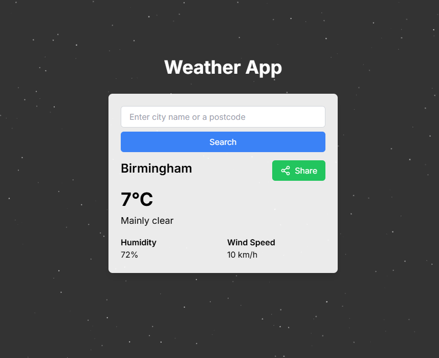
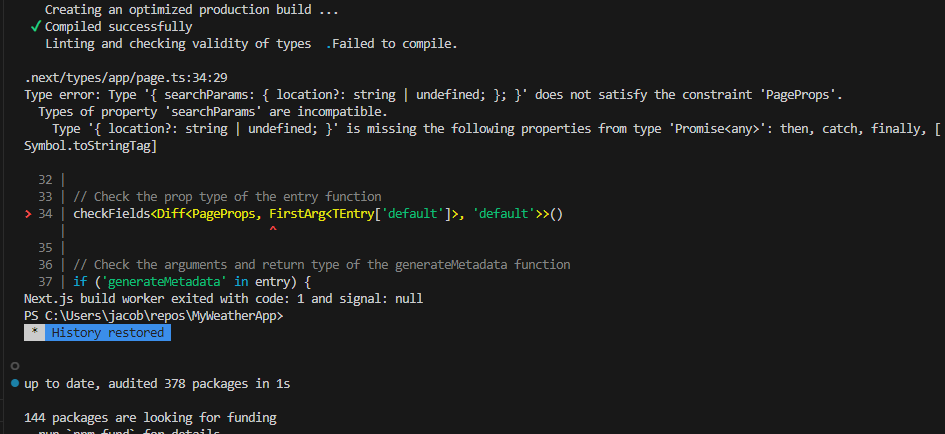

# Weather App

A simple weather app built with Next.js, TypeScript, and Tailwind CSS. This app allows users to search for weather information by city name or postcode and displays the current weather conditions.

## Features

- Search for weather information by city name or postcode
- Display current weather conditions including temperature, humidity, and wind speed
- Copy the URL of you're search to share with others
- Animated particle background

## Technologies Used

- [Next.js](https://nextjs.org/)
- [React](https://reactjs.org/)
- [TypeScript](https://www.typescriptlang.org/)
- [Tailwind CSS](https://tailwindcss.com/)
- [Open-Meteo API](https://open-meteo.com/)
- [Postcodes.io API](https://postcodes.io/)
- [Fusealgem Paticles Component](https://www.fuselagem.com.br/docs/components/particles)
- [Vercel V0](https://v0.dev/)

## Creation Process

- This app started out as a quick (2-3 hour) workshop for the team I was working in on my School of Code Bootcamp.
- The initial goal for this application was to attempt using typescipt in a React environment for the first time as we had just started branching out from vanilla JavaScript.
- We started out by using Vercel V0 to help with what the general file structure for our project would look like aswell as the basic CSS styling we would want to start with so that we could deviate into our own styling. We chose to stick with tailwind here as a challenge as some of our group members had not used tailwind before and the ones who had, had only done so a handful of times.

---

- My role for this project was to pair program with one other, in order to pick out what API would be best for us to implement into our project and get it set up to make fetch requests. After looking through the documentation for [Open Weather Map](https://openweathermap.org/api) and [Open-Meteo](https://open-meteo.com/), we decided on the latter as documentation was much more clear for what we needed from our API, along with it being free for non-commercial use while Open Weather Map only gave 1000 free calls per day.
- We began creating the getWeatherData function to make a call to Open-Meteo's geocoding API as, for the weather forcast API, we needed the latitude and longitude of the location we wanted the forecast for, this location would be provided by the users input.
- We extracted the coordinates from here and plugged them into another call to their forecast API. We decided not to overload the page with data and set up our WeatherData type along with our return to only pull the location, temperature, description, humidity and windspeed.
- This information was then exported to our WeatherDisplay to be used in the return statement so that the data would be rendered on screen.
- As we still had a bit of time left from this, I also researched and created a button in TypeScript that that would take the URL from a specific search and copy it for the user, so they could share the information with other people.
- Other parts that were looked at by my team were getting the search to work with postcodes which was not completed, and having a dynamic background using the Fusealgem particles component, but this was left at just a static particle background.

---

- On the weekend, I made a fork of this project and decided I wanted to see if I could finish it off myself and put the app live.
- To start, I looked at the particles background and with the assistance of Github CoPilot, changed from using a useMousePosition custom hook to track the mouse and update the state, to useing useRef to track the mouse position and updating it in the handleMouseMove function.
- I then determined that, in order to use postcodes as a search, I would need a way of getting the lattitude and longitude of a specific postcode, as well as a way to determine what search was a location and what was a postcode. For this, I found [Postcodes.io API](https://postcodes.io/) which gave me exactly what I needed to create getWeatherDataByPostcode that simply swapped the initial geocoding API call with one to postcodes.io instead.
- Now that this function was created, I needed a way to determine what function to use when the user searched. The easiest way I thought to do this was to check the users input for any digits, as all post codes will have at least one digit and no places (as far as I know) have digits in their name.
- I was now happy with my final product and deployed my app using Vercel at https://v0-weather-woad.vercel.app/

## Positives

- Great experience in a variety of areas I have not worked in as much.Even basic things such as making a button was a learning experience as I have never done it in TypeScript before this along with it being the first time I have published an app on Vercel and running into unexpected challenges that needed to be overcome.
- In the weeks prior to this on the School Of Code Bootcamp, my groups often took a driver/navigator approach meaning we were all working on the same area together at one time. This project gave me the opportunity to see how you work with other developers on the same project simultaneously, by using branching for issues and then making pull requests back into main and resolving merge conflicts.

## Challenges

- WeatherInfo and WeatherDisplay were origionally a single component, but we ran into errors when rendering. Once we seperated these out so that the logic was in the display file and the rendering of the component was done in the Info, the issue fixed.
- Picking up on the areas of code that other people worked on and changing them to work with the new features I had created or parts I had changed.
- I had problems when trying to deploy my app to Vercel as the 'npm run build' command continuosly failed. I asked for the Help of my mentor who is proficient in TypeScript and researched and found these 2 links regarding the issue I was having https://github.com/vercel/next.js/discussions/71997 - https://stackoverflow.com/questions/79124951/type-error-in-next-js-route-type-params-id-string-does-not-satis which lead me to wrapping my layout in a suspense boundary. I also had problems with ESLint stopping the build mainly becuase of typing errors in the particles component, because of this I disabled the linting for the areas causing problems as this is not core functionality of the app.
  

## Stretch Goals

- Add timescale functionality to see the weather for more than just the instant you search.
- Viewable map of the local area you search for which the user can also interact with to change the location of the search.
- Random button to pick a random geo location and present the info.
